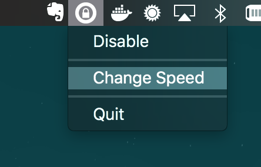
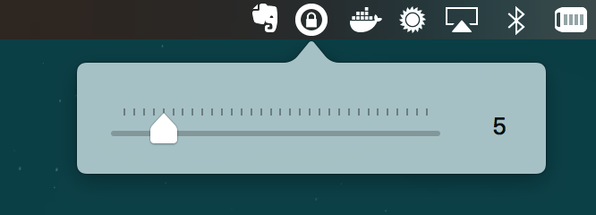

# Scroll SANITY

An extremely simple macOS application that lives in your Menu Bar and removes the 'momentum scrolling' that
is on by default on the desktop OS. It drives me INSANE that this is the default configuration, and I'm
sure it does for you too. Now you can hijack that scroll and replace it with a TOTALLY NORMAL, TOTALLY DISCRETE
scroll-step of YOUR CHOOSING. Huzzah.




## Requirements

I'll get this up on the App Store sooner than later, but in the mean time you can build this yourself
provided you have Xcode.

## Installation

```bash
./build.sh
```
